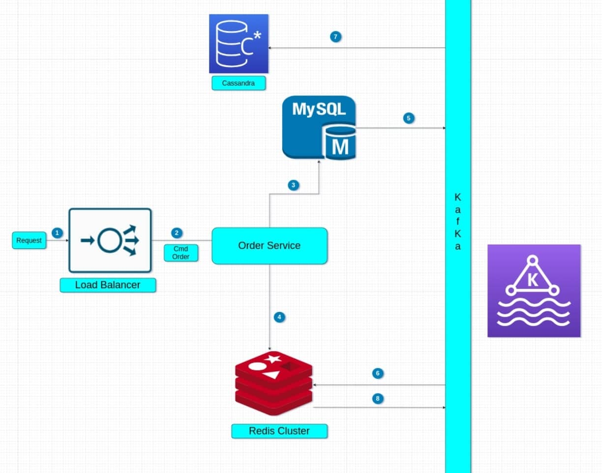

# HightPerformancePaymentGateway-OrderService
Service query for https://github.com/Nghiait123456/HighPerformancePaymentGateway-BalanceService

# Command
- [Contexts command](#ContextCmd)
- [System design command](#SystemDesignCmd)
# Query
- [Context Query](#ContextsQuery)
- [System design query](#SystemDesignQuery)

## Contexts command? <one name="ContextCmd"></one>
The service has one threshold of 20 M rps, it exceeds the IO of most DB, all read and write operations will take place in Ram, there will be very few queries to the DB.  
System design needs one combination of: local-in-memory, remote-in-memory, invalidate cache and distribute database 

## System design command? <one name="SystemDesignCmd"></one>
1) Incoming Request to rate limit layer network, Waf and to Load Balancer  
2) LB to Order Command Service  
3) and 4) Every Order is valid will save in Mysql, and currency create one record in redis cluster.  
5) If Order change status, we action save in mysql cluster. Logs from mysql cluster send to kafka.  
6) Cache service will subscribe kafka and update cache data  
7) When Order sucess, we create order in cassandra and remove order in mysql cluster. It will make the size of mysql stable and not too big. it will make mysql work faster  
8) When cache in validate, we get event from redis cluster, and push event to kafka. We update the order status with it. Redis invalidate don't guarantee 100% correct invalidate, we have plus one service auto check to reduce the error to the lowest.  

Prevent race conditions update cache, we have simple solution: One resource push to kafka ( mysql logs, cassandra,...) all include a unix timestand when the source is created. We are only update cache if unix timestand larger. Solution dont cover all case but cover most of the case race conditions cache.  

## Contexts query? <one name="ContextsQuery"></one>
This is query data for service https://github.com/Nghiait123456/HighPerformancePaymentGateway-BalanceService
The service has one threshold of 20 M rps, it exceeds the IO of most DB, all read and write operations will take place in Ram, there will be very few queries to the DB.  
System design needs one combination of: local-in-memory, remote-in-memory and invalidate cache.  
## System design query? <one name="SystemDesignQuery"></one>

1) Incoming Request to rate limit layer network and to Load Balancer  
2) LB to Order Query Service  
3) Query Service checks data in Redis Cluster. All data order are saved in redis when the request order is created.  
4) If not in redis, Query Service will look in Query DB service. To avoid race conditions query to DB, the first request will create one lock record with the purpose of notifying other requests that there is one lock with this object. Other requests when reading this request lock will return status pending.  
5) There will be one smart mechanism, based on the data request creation time and system timeout to decide whether to query into Cassandra or Mysql first. Cassandra contains success or timeout records, and Mysql contains pending or processing records. If not found in one DB, it will look in the other DB, not found in any DB will return an error.  
6) Event update status will be updated to the corresponding redis cluster.  

Prevent race conditions update cache, we have simple solution: One resource push to kafka ( mysql logs, cassandra,...) all include a unix timestand when the source is created. We are only update cache if unix timestand larger. Solution dont cover all case but cover most of the case race conditions cache.  